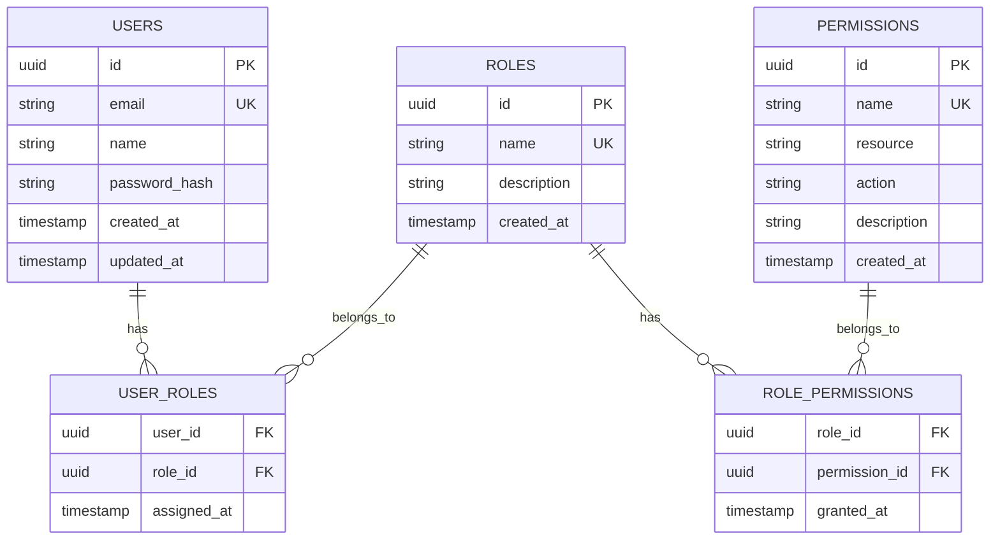

# Database Schema Design

## Entity-Relationship Diagram



## Database Tables Specification

### 1. USERS Table

| Column | Type | Constraints | Description |
|--------|------|-------------|-------------|
| id | UUID | PRIMARY KEY, DEFAULT uuid_generate_v4() | Unique identifier for each user |
| email | VARCHAR(255) | UNIQUE, NOT NULL | User's email address for login |
| name | VARCHAR(255) | NOT NULL | User's display name |
| password_hash | VARCHAR(255) | NOT NULL | Bcrypt hashed password |
| created_at | TIMESTAMP WITH TIME ZONE | DEFAULT CURRENT_TIMESTAMP | Account creation timestamp |
| updated_at | TIMESTAMP WITH TIME ZONE | DEFAULT CURRENT_TIMESTAMP | Last update timestamp |

**Indexes:**
- Primary key index on `id`
- Unique index on `email`

### 2. ROLES Table

| Column | Type | Constraints | Description |
|--------|------|-------------|-------------|
| id | UUID | PRIMARY KEY, DEFAULT uuid_generate_v4() | Unique identifier for each role |
| name | VARCHAR(50) | UNIQUE, NOT NULL | Role name (e.g., student, teacher, admin) |
| description | TEXT | NULLABLE | Detailed description of role purpose |
| created_at | TIMESTAMP WITH TIME ZONE | DEFAULT CURRENT_TIMESTAMP | Role creation timestamp |

**Indexes:**
- Primary key index on `id`
- Unique index on `name`

### 3. PERMISSIONS Table

| Column | Type | Constraints | Description |
|--------|------|-------------|-------------|
| id | UUID | PRIMARY KEY, DEFAULT uuid_generate_v4() | Unique identifier for each permission |
| name | VARCHAR(100) | UNIQUE, NOT NULL | Permission name (e.g., create_course) |
| resource | VARCHAR(100) | NOT NULL | Resource being protected (e.g., course, grades) |
| action | VARCHAR(50) | NOT NULL | Action allowed (e.g., create, read, update, delete) |
| description | TEXT | NULLABLE | Detailed description of permission |
| created_at | TIMESTAMP WITH TIME ZONE | DEFAULT CURRENT_TIMESTAMP | Permission creation timestamp |

**Indexes:**
- Primary key index on `id`
- Unique index on `name`
- Composite index on `(resource, action)`

### 4. USER_ROLES Table (Junction)

| Column | Type | Constraints | Description |
|--------|------|-------------|-------------|
| user_id | UUID | FOREIGN KEY REFERENCES users(id) ON DELETE CASCADE | Reference to user |
| role_id | UUID | FOREIGN KEY REFERENCES roles(id) ON DELETE CASCADE | Reference to role |
| assigned_at | TIMESTAMP WITH TIME ZONE | DEFAULT CURRENT_TIMESTAMP | When role was assigned |

**Constraints:**
- Composite primary key on `(user_id, role_id)`
- Foreign key constraints with CASCADE DELETE

**Indexes:**
- Composite primary key index
- Index on `user_id`
- Index on `role_id`

### 5. ROLE_PERMISSIONS Table (Junction)

| Column | Type | Constraints | Description |
|--------|------|-------------|-------------|
| role_id | UUID | FOREIGN KEY REFERENCES roles(id) ON DELETE CASCADE | Reference to role |
| permission_id | UUID | FOREIGN KEY REFERENCES permissions(id) ON DELETE CASCADE | Reference to permission |
| granted_at | TIMESTAMP WITH TIME ZONE | DEFAULT CURRENT_TIMESTAMP | When permission was granted |

**Constraints:**
- Composite primary key on `(role_id, permission_id)`
- Foreign key constraints with CASCADE DELETE

**Indexes:**
- Composite primary key index
- Index on `role_id`
- Index on `permission_id`

## SQL Schema Creation Script

```sql
-- Enable UUID extension
CREATE EXTENSION IF NOT EXISTS "uuid-ossp";

-- Users table
CREATE TABLE users (
    id UUID PRIMARY KEY DEFAULT uuid_generate_v4(),
    email VARCHAR(255) UNIQUE NOT NULL,
    name VARCHAR(255) NOT NULL,
    password_hash VARCHAR(255) NOT NULL,
    created_at TIMESTAMP WITH TIME ZONE DEFAULT CURRENT_TIMESTAMP,
    updated_at TIMESTAMP WITH TIME ZONE DEFAULT CURRENT_TIMESTAMP
);

-- Roles table
CREATE TABLE roles (
    id UUID PRIMARY KEY DEFAULT uuid_generate_v4(),
    name VARCHAR(50) UNIQUE NOT NULL,
    description TEXT,
    created_at TIMESTAMP WITH TIME ZONE DEFAULT CURRENT_TIMESTAMP
);

-- Permissions table
CREATE TABLE permissions (
    id UUID PRIMARY KEY DEFAULT uuid_generate_v4(),
    name VARCHAR(100) UNIQUE NOT NULL,
    resource VARCHAR(100) NOT NULL,
    action VARCHAR(50) NOT NULL,
    description TEXT,
    created_at TIMESTAMP WITH TIME ZONE DEFAULT CURRENT_TIMESTAMP
);

-- User-Roles junction table
CREATE TABLE user_roles (
    user_id UUID REFERENCES users(id) ON DELETE CASCADE,
    role_id UUID REFERENCES roles(id) ON DELETE CASCADE,
    assigned_at TIMESTAMP WITH TIME ZONE DEFAULT CURRENT_TIMESTAMP,
    PRIMARY KEY (user_id, role_id)
);

-- Role-Permissions junction table
CREATE TABLE role_permissions (
    role_id UUID REFERENCES roles(id) ON DELETE CASCADE,
    permission_id UUID REFERENCES permissions(id) ON DELETE CASCADE,
    granted_at TIMESTAMP WITH TIME ZONE DEFAULT CURRENT_TIMESTAMP,
    PRIMARY KEY (role_id, permission_id)
);

-- Create indexes for better performance
CREATE INDEX idx_user_roles_user_id ON user_roles(user_id);
CREATE INDEX idx_user_roles_role_id ON user_roles(role_id);
CREATE INDEX idx_role_permissions_role_id ON role_permissions(role_id);
CREATE INDEX idx_role_permissions_permission_id ON role_permissions(permission_id);
CREATE INDEX idx_permissions_resource_action ON permissions(resource, action);
```

## Default Data Insertion

```sql
-- Insert default roles
INSERT INTO roles (name, description) VALUES 
    ('student', 'Student role with basic access to courses and grades'),
    ('teacher', 'Teacher role with course management and grading access'),
    ('admin', 'Administrator role with full system access');

-- Insert default permissions
INSERT INTO permissions (name, resource, action, description) VALUES 
    -- Course permissions
    ('create_course', 'course', 'create', 'Create new courses'),
    ('view_course', 'course', 'read', 'View course details and content'),
    ('update_course', 'course', 'update', 'Update course information and content'),
    ('delete_course', 'course', 'delete', 'Delete courses permanently'),
    
    -- Grade permissions
    ('view_grades', 'grades', 'read', 'View student grades and transcripts'),
    ('update_grades', 'grades', 'update', 'Update and manage student grades'),
    
    -- Student management permissions
    ('view_students', 'students', 'read', 'View student profiles and information'),
    ('manage_students', 'students', 'manage', 'Full student management capabilities'),
    
    -- User management permissions
    ('manage_users', 'users', 'manage', 'Create, update, and delete user accounts'),
    ('assign_roles', 'users', 'assign_roles', 'Assign and remove user roles'),
    
    -- System permissions
    ('view_analytics', 'analytics', 'read', 'View system analytics and reports'),
    ('manage_settings', 'settings', 'manage', 'Manage system settings and configuration');

-- Assign permissions to roles
-- Student role permissions
INSERT INTO role_permissions (role_id, permission_id)
SELECT r.id, p.id FROM roles r, permissions p
WHERE r.name = 'student' 
AND p.name IN ('view_course', 'view_grades');

-- Teacher role permissions
INSERT INTO role_permissions (role_id, permission_id)
SELECT r.id, p.id FROM roles r, permissions p
WHERE r.name = 'teacher' 
AND p.name IN (
    'create_course', 'view_course', 'update_course',
    'view_grades', 'update_grades', 'view_students',
    'view_analytics'
);

-- Admin role gets all permissions
INSERT INTO role_permissions (role_id, permission_id)
SELECT r.id, p.id FROM roles r, permissions p
WHERE r.name = 'admin';
```

## Design Considerations

### 1. **UUID vs Integer IDs**
- UUIDs chosen for better distributed system compatibility
- No sequential information exposure
- Can generate IDs client-side if needed

### 2. **Soft Delete vs Hard Delete**
- Currently using hard delete with CASCADE
- Consider adding `deleted_at` columns for soft delete if audit trail needed

### 3. **Performance Optimizations**
- Indexes on all foreign keys
- Composite index on permission lookup
- Consider partitioning user_roles table if user base grows large

### 4. **Security Considerations**
- Password hashes stored, never plain text
- Email uniqueness enforced at database level
- Role/permission names are unique to prevent duplicates

### 5. **Scalability Patterns**
- Junction tables allow many-to-many relationships
- No circular dependencies
- Clean separation of concerns

## Relationship Summary

1. **Users ↔ Roles**: Many-to-Many through `user_roles`
2. **Roles ↔ Permissions**: Many-to-Many through `role_permissions`
3. **Cascade Deletes**: Removing a user/role/permission cleans up junction tables
4. **No Direct User-Permission Link**: Permissions always go through roles