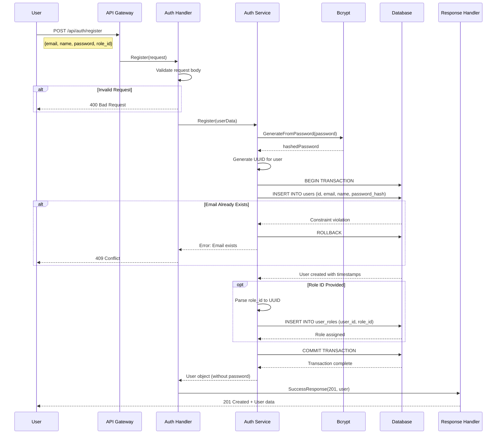
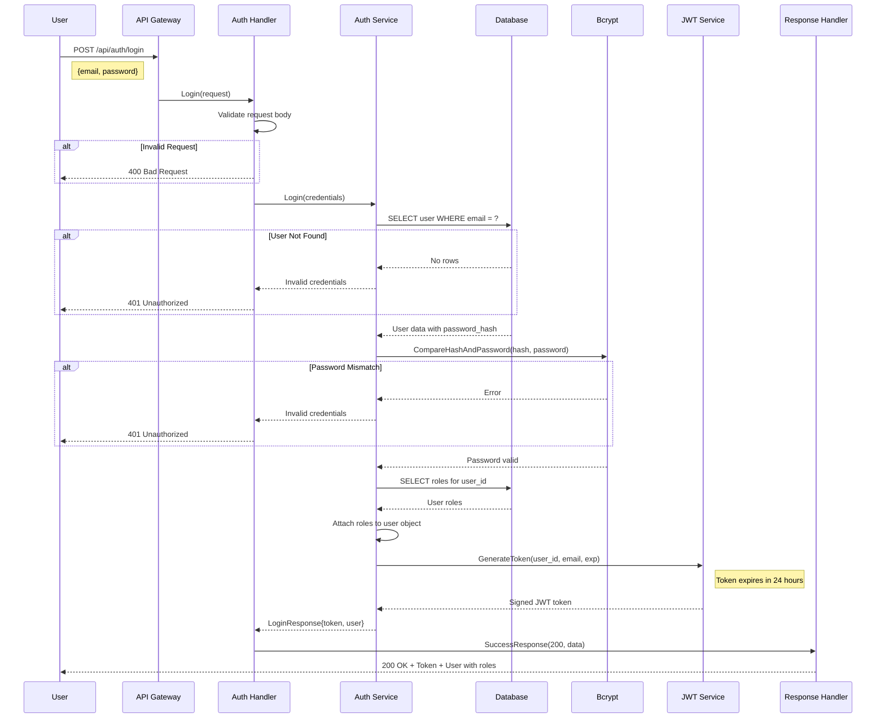

# Sequence Diagrams

## 1. User Registration Flow

This diagram shows the complete user registration process including password hashing and role assignment.



---

## 2. User Login Flow

This diagram illustrates the authentication process and JWT token generation.



---

## 3. Authorization Check Flow

This diagram shows how the system validates permissions for protected endpoints.

```mermaid
sequenceDiagram
    participant User
    participant API as API Gateway
    participant AuthMiddleware as Auth Middleware
    participant JWT as JWT Parser
    participant Context as Request Context
    participant RBACService as RBAC Service
    participant Database
    participant Handler as Course Handler
    participant Response as Response Handler

    User->>API: GET /api/courses
    Note right of User: Authorization: Bearer <token>
    
    API->>AuthMiddleware: Authenticate()
    
    AuthMiddleware->>AuthMiddleware: Extract token from header
    
    alt No Authorization Header
        AuthMiddleware-->>User: 401 Unauthorized
    end
    
    AuthMiddleware->>JWT: Parse(token, secret)
    
    alt Invalid Token
        JWT-->>AuthMiddleware: Parse error
        AuthMiddleware-->>User: 401 Unauthorized
    end
    
    JWT-->>AuthMiddleware: Claims{user_id, email, exp}
    
    AuthMiddleware->>AuthMiddleware: Check expiration
    
    alt Token Expired
        AuthMiddleware-->>User: 401 Unauthorized
    end
    
    AuthMiddleware->>Context: Set("user_id", user_id)
    AuthMiddleware->>Context: Set("email", email)
    
    AuthMiddleware->>AuthMiddleware: Authorize("course", "read")
    AuthMiddleware->>RBACService: HasPermission(user_id, "course", "read")
    
    RBACService->>Database: Query user permissions
    Note right of Database: JOIN users, user_roles,<br/>role_permissions, permissions
    
    Database-->>RBACService: Permission check result
    
    alt No Permission
        RBACService-->>AuthMiddleware: false
        AuthMiddleware-->>User: 403 Forbidden
    end
    
    RBACService-->>AuthMiddleware: true
    AuthMiddleware->>API: Next() - Continue to handler
    
    API->>Handler: ListCourses(context)
    Handler->>Context: Get("user_id")
    Context-->>Handler: user_id
    
    Handler->>Database: SELECT courses
    Database-->>Handler: Course list
    
    Handler->>Response: SuccessResponse(200, courses)
    Response-->>User: 200 OK + Course data